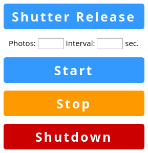

# SONY Raspberry Pi Remote Shutter Release

A Raspberry Pi-based remote shutter release for SONY cameras compatible with the RM-VPR1 cable release. The project can be easily adapted to work with other cameras, too.

