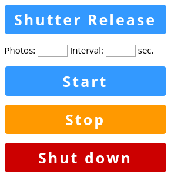

# Sony Raspberry Pi Remote Shutter Release

A Raspberry Pi-based remote shutter release for Sony cameras compatible with the RM-VPR1 cable release. The project can be easily adapted to work with other cameras, too. Further info: [wp.me/pEQNe-1pU](http://wp.me/pEQNe-1pU)

